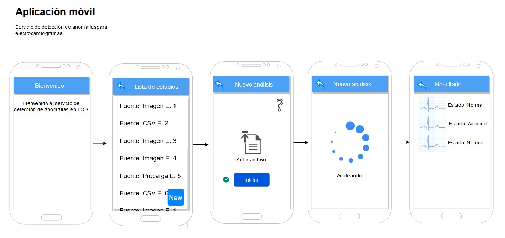
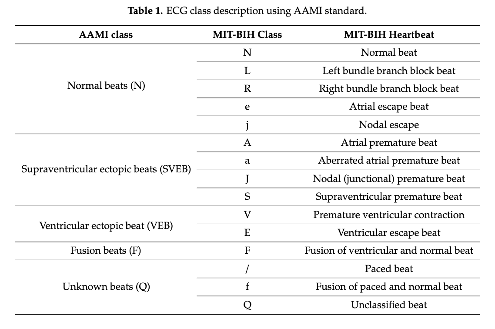
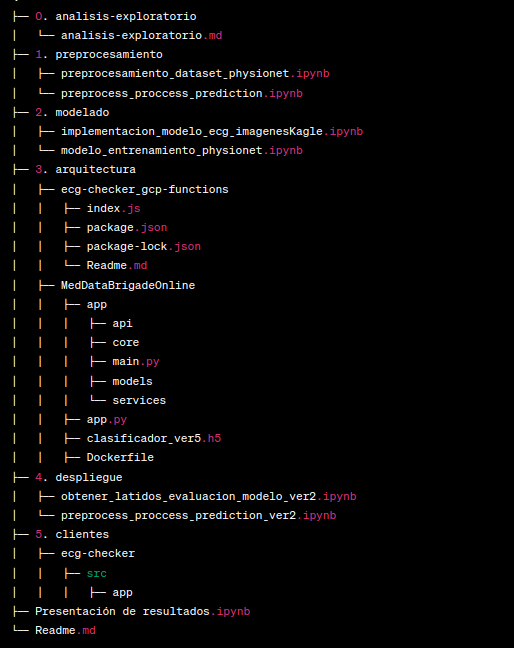
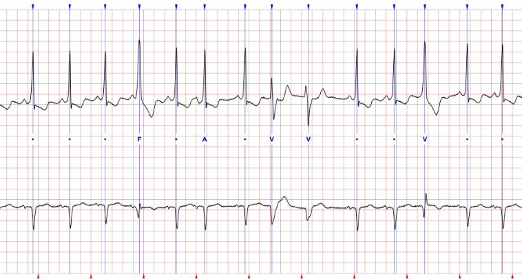
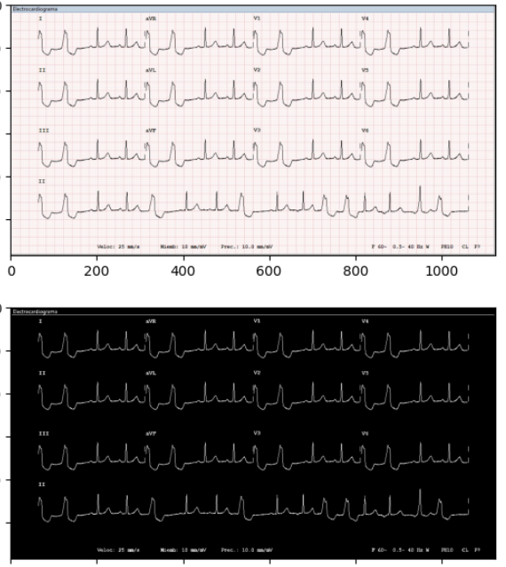
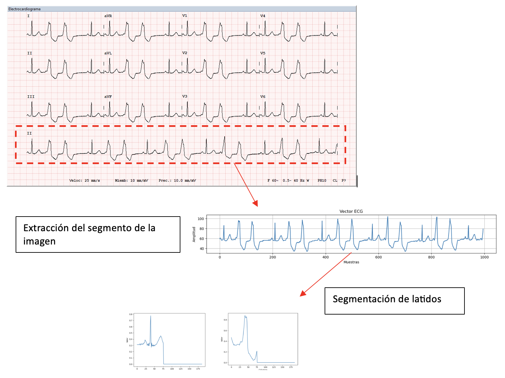
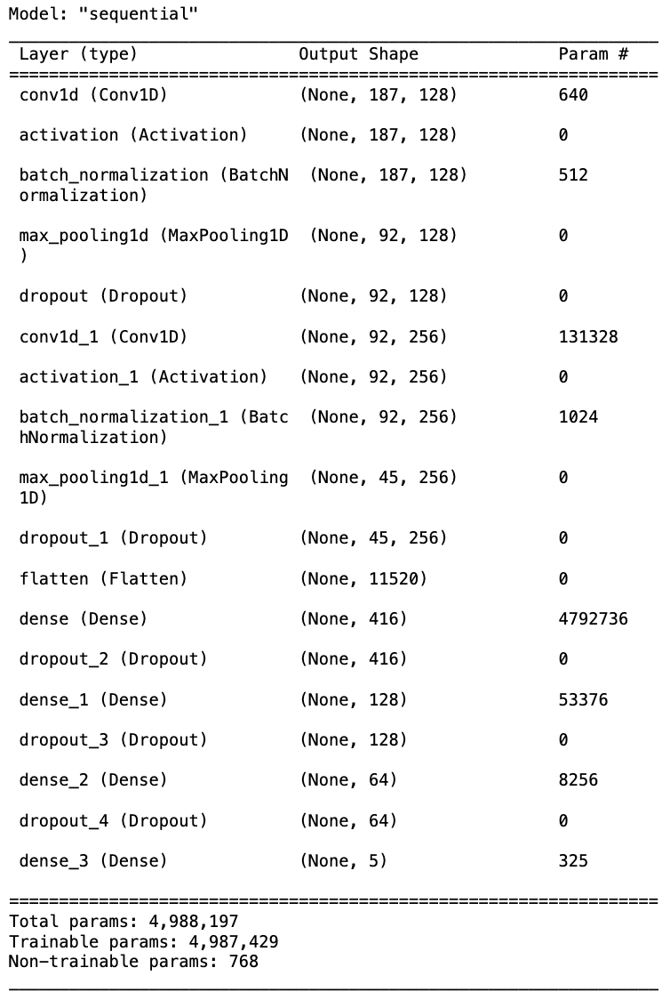
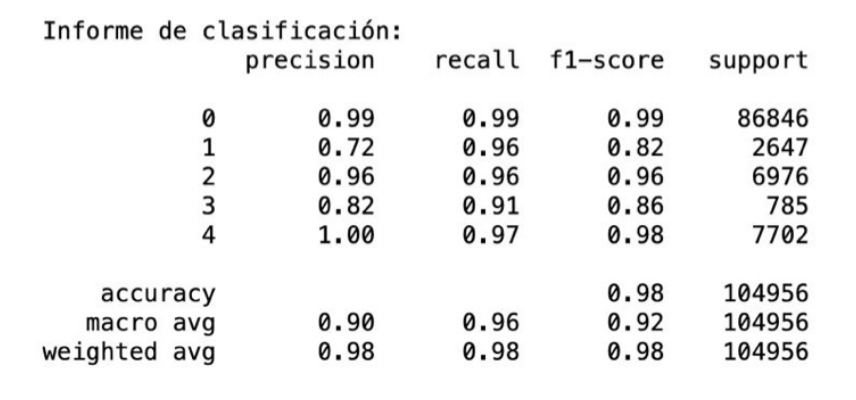

# Aplicación con redes neuronales para la detección de arritmias  (ECG) 

## Introducción

El servicio de detección de anomalias en ECG es un conjunto de herramientas tecnológicas para la clasificación de anomalías mediante latidos de una señal de electrocardiograma (ECG) usando un modelo de inteligencia artificial entrenado para este propósito.

*Imagen 1, esquema del servicio móvil*

## Tabla de contenidos

1. [Resumen del proyecto de clasificación de señales ECG](#1-resumen-del-proyecto-de-clasificación-de-señales-ecg)
2. [Estructura de carpetas](#2-estructura-de-carpetas)
3. [Flujo de trabajo](#3-flujo-de-trabajo)
4. [Requisitos](#4-requisitos)
5. [Referencias](#5-referencias)
6. [Licencia](#6-licencia)

## 1. Resumen del proyecto de clasificación de señales ECG

Este proyecto tuvo como objetivo entrenar y validar un modelo de red neuronal para identificar y clasificar latidos en señales de electrocardiograma (ECG) conforme a anomalias conocidas en el contexto médico. El código proporcionado incluye la carga de datos, el preprocesamiento, la definición del modelo, el entrenamiento y la evaluación del rendimiento del modelo.

*Clases y subclases de clasificación de latidos*

### Metodología del proyecto 

1. **Carga de datos**: Se cargan los datos de entrenamiento y prueba a partir de archivos previamente generados y obtenidos mediante repositorios de datos especializados.

2. **Análisis del dataset y preprocesamiento**: Los datos se estudian y se preprocesan antes de utilizarlos en el modelo. El preprocesamiento incluye la normalización y el escalado de los datos (**0. analisis exploratorio**, **1. preprocesamiento**).

3. **Definición del modelo**: Se define y compila un modelo de red neuronal llamado `modelo_opt` utilizando la biblioteca Keras (**2. modelado**).

4. **Entrenamiento del modelo**: Se entrena el modelo utilizando los datos de entrenamiento (X_train, y_train) y validación (X_test, y_test) en 30 épocas. Durante el entrenamiento, se emplean dos callbacks: uno para TensorBoard (callback_tensorboard) y otro para detener el entrenamiento cuando no hay mejoras en la validación (callback_early) (**2. modelado**).

5. **Visualización de resultados**: Se visualizan los resultados del entrenamiento usando la función `visualizacion_resultados()`, que muestra gráficas de la precisión y la pérdida en el entrenamiento y la validación a lo largo de las épocas (**2. modelado**).

6. **Evaluación del rendimiento**: Se evalúa el rendimiento del modelo utilizando una función llamada `resultados()`, que predice las etiquetas en el conjunto de prueba (X_test) y muestra una matriz de confusión y un informe de clasificación con métricas de rendimiento como precisión, recall y f1-score (**2. modelado**).

7. **Guardado del modelo**: Se guarda el modelo entrenado en un archivo llamado 'clasificador_ver5.h5' para su uso posterior en la clasificación de nuevas señales ECG (**2. modelado**).

8. **Despliegue en google cloud**: Se hace uso de recursos de Google Cloud como: Cloud Functions para poder conectar el cliente con el servicio de predicción, se implementa el servicio de predicción mediante Cloud Run, usando Fast API y Docker se construye una imágen que es desplegada para recibir peticiones de servicio.

9. **Cliente web aplicación de Ionic**: El cliente, un servicio desplegado en Firebase Hosting basado en Ionic Framework, permite la creación de cuentas de usuario, el envío de imágenes de ECG y CSV con trazos de 10 segundos, permite al usuario revisar los resultados de todos sus ensayos, los resultados se almacenan en MongoDB Atlas y Cloud Storage.

## 2. Estructura de carpetas

## 3. Flujo de trabajo

1. Importación de datos y purgado del dataset para entrenar el modelo
2. Procesamiento y vectorización de la imagen para poder ser usada por el modelo
3. Contrucción y predicciones
4. Despligue en google cloud y cliente web

### 1. preprocesamiento/preprocesamiento_dataset_physionet.ipynb

Corresponde a la sección de preprocesamiento del proyecto de detección de arritmias cardíacas en señales de electrocardiogramas (ECG).

En la primera parte del código, se importan las librerías necesarias para el preprocesamiento y modelado de los datos. Estas librerías incluyen herramientas para el análisis de señales, manipulación de datos, visualización, aprendizaje automático y procesamiento de imágenes.

En la segunda parte del código, se definen varias funciones útiles para el preprocesamiento de las señales de ECG.

La función extrear_derivacion se encarga de extraer para un archivo WFDB dado, el canal específico que incluye el vector de datos de la derivación y las anotaciones. Retorna el vector de datos de la derivación, las anotaciones y la longitud en número de muestras de la señal.

La función graficar permite graficar el contenido del vector y anotación, para un intervalo de tiempo en segundos especificado como start_time, end.

La función process_ecg_signal2 procesa la señal de ECG, segmentando la señal en ventanas de 10 segundos y extrayendo subsegmentos de 187 muestras a partir de las anotaciones. Estos subsegmentos son normalizados, rellenados con ceros para tener una longitud fija de 1600 muestras y remuestreados a una frecuencia de 125 Hz. La función retorna una lista de segmentos, una lista de etiquetas de las anotaciones, una lista de los periodos cardiacos y una lista de los subsegmentos no procesados.

La función plot_filtered_segments permite graficar los segmentos de la señal que corresponden a una etiqueta específica.

La función resample_vector remuestrea un vector a una nueva frecuencia de muestreo.

La función padding agrega ceros al final de los segmentos para que tengan una longitud fija de 187 muestras.

La función procesar utiliza las funciones anteriores para procesar un archivo de señal de ECG, guardar los segmentos y sus etiquetas en un archivo CSV y retornar un DataFrame con los segmentos y sus etiquetas.

La función lista genera una lista de nombres de archivo de señales de ECG en el rango especificado.

La función reetiquetado agrupa las categorías de anotaciones en 5 categorías principales (N, S, V, F y Q).

La función etiqueta_numerica mapea las etiquetas de anotaciones a números.

La función proporcion_ceros calcula la proporción de ceros en una fila de datos.

En resumen, es una serie de funciones y utilidades para el preprocesamiento de señales de ECG para la detección de arritmias cardíacas. Estas funciones se utilizan para leer, segmentar, filtrar, normalizar y guardar segmentos de señales de ECG en un archivo CSV para su posterior uso en el modelado y entrenamiento de un clasificador de arritmias cardíacas.

### 2. preprocess_proccess_prediction_ver2.ipynb

El archivo preprocess_process_prediction_ver2.ipynb es un archivo de código Python que contiene funciones y procesos para procesar una imagen que contiene una señal de electrocardiograma (ECG) y predecir la clase de arritmia cardíaca.

Las principales librerías utilizadas son:

- numpy
- cv2
- matplotlib.pyplot
- PIL
- wfdb
- pandas
- tensorflow

La etapa de procesamiento de imagen consta de varias funciones que extraen el vector de datos del ECG de la imagen, incluyendo la conversión a escala de grises, binarización y extracción del vector de la señal ECG. También se incluyen funciones para suavizar el vector ECG, detectar picos y graficar el vector ECG.

La etapa de preprocesamiento del vector ECG extraído incluye varias funciones que remuestrean el vector, lo normalizan, lo derivan, eliminan valores negativos y buscan los máximos locales. También se incluyen funciones para extraer los segmentos de 10 segundos de los máximos locales encontrados y ajustar su longitud.

Por último, el archivo contiene una función que utiliza un modelo de aprendizaje profundo (clasificador_ver5.h5) para clasificar los segmentos de latidos en una de las cinco clases posibles (4 anomaías y 1 para latidos normales) ('N', 'S', 'V', 'F' y 'Q'). La función `evalua()` recibe el dataframe con los segmentos de latidos y devuelve las clases predichas por el modelo para cada segmento.

El archivo también contiene un ejemplo que muestra cómo se pueden llamar a estas funciones para procesar una imagen de ECG y predecir las clases de arritmia cardíaca de los segmentos de latidos extraídos.

### 3. modelado/modelo_entrenamiento_physionet.ipynb

Contiene el código para entrenar un modelo de clasificación de latidos cardíacos utilizando un conjunto de datos de Physionet. El archivo comienza importando las bibliotecas necesarias y luego carga el conjunto de datos previamente depurado. A continuación, se realiza la división de los datos en conjuntos de entrenamiento y prueba.

Para abordar el desequilibrio de clases en el conjunto de datos, se realiza un balanceo de las clases utilizando técnicas de oversampling y undersampling. Luego, se vuelve a dividir el conjunto de datos en entrenamiento y prueba.

Aquí hay un resumen del código en el archivo:

Importar las bibliotecas necesarias.
Cargar el conjunto de datos previamente depurado.
Separar las características y las etiquetas en cada DataFrame.
Dividir el conjunto de datos en entrenamiento y prueba.
Balancear las clases en el conjunto de datos utilizando técnicas de oversampling y undersampling.
Combinar las clases balanceadas y mezclar los datos.
Dividir el conjunto de datos en entrenamiento y prueba nuevamente.
Imprimir las dimensiones de los conjuntos de entrenamiento y prueba.
El objetivo de este archivo es preparar los datos y abordar el desequilibrio de clases antes de entrenar un modelo de clasificación de latidos cardíacos.

Define una función llamada "visualizacion_resultados" que ayuda a visualizar los resultados de entrenamiento y validación de un modelo de aprendizaje profundo. La función crea gráficos de barras para la precisión y la pérdida en función de las épocas de entrenamiento.

Posteriormente, se importan las bibliotecas necesarias y se define el modelo de red neuronal convolucional 1D para el problema de clasificación. La arquitectura del modelo incluye capas de convolución, activación, normalización por lotes, agrupación máxima (MaxPooling) y abandono (Dropout). Finalmente, se añaden capas completamente conectadas (Dense) y se compila el modelo utilizando el optimizador Adam, la pérdida de entropía cruzada escasa categórica y la métrica de precisión.

Se utilizan las devoluciones de llamada "TensorBoard" y "EarlyStopping" para monitorear y guardar los resultados de entrenamiento, y detener el entrenamiento si no hay mejoras en la pérdida después de un cierto número de épocas (en este caso, 5 épocas). El modelo se entrena utilizando estos parámetros y devoluciones de llamada.

### 4. Despliegue en Google Cloud y Cliente Web Aplicación de Ionic

En este proyecto, también se tiene contemplado el despliegue del modelo entrenado en la nube de Google y la creación de una aplicación web para su uso en línea.

Para el despliegue en Google Cloud, se requiere la creación de una instancia de máquina virtual que tenga instaladas las herramientas necesarias (TensorFlow, Keras, etc.) y la carga del modelo entrenado para su uso (para esto usamos Dockerfile). Una vez que el modelo esté disponible en la nube, se puede utilizar mediante una API que acepta solicitudes de entrada y devuelve las predicciones correspondientes.

Para la creación de la aplicación web, se utiliza el framework Ionic, que permite crear aplicaciones móviles y web utilizando tecnologías como HTML, CSS y JavaScript. Se define una interfaz gráfica de usuario que permite cargar una señal ECG en formato de imagen y CSV, con esto recibe una predicción de clasificación basada en el modelo entrenado. Se hace uso de la API desplegada en cloud Run para hacer las predicciones en tiempo real.

En resumen, el proyecto tiene como objetivo la creación de un modelo de clasificación de señales de ECG y su despliegue en la nube de Google y en una aplicación web para su uso en línea. El código proporcionado incluye el preprocesamiento de los datos, la definición del modelo de red neuronal, el entrenamiento y la evaluación del rendimiento del modelo, así como las utilidades necesarias para su despliegue en la nube y su integración en una aplicación web.

## 4. Requisitos

- Python 3.7 o superior
- TensorFlow 2.6.0 o superior
- Keras 2.6.0 o superior
- Matplotlib 3.3.4 o superior
- Seaborn 0.11.2 o superior
- NumPy 1.19.5 o superior

## 5. Referencias

Datos obtenidos de:

- https://physionet.org/content/mitdb/1.0.0/
- https://www.kaggle.com/datasets/shayanfazeli/heartbeat
- Artículo: "Clasificación de Arritmias Cardíacas mediante Redes Neuronales Convolucionales y Optimización por Enjambre de Partículas" https://www.researchgate.net/publication/361521007_Clasificacion_de_Arritmias_Cardiacas_mediante_Redes_Neuronales_Convolucionales_y_Optimizacion_por_Enjambre_de_Particulas

## 6. Licencia

El contenido de este proyecto está licenciado bajo la licencia [MIT](https://opensource.org/licenses/MIT) y el código fuente bajo la licencia [Apache 2.0](http://www.apache.org/licenses/LICENSE-2.0).
